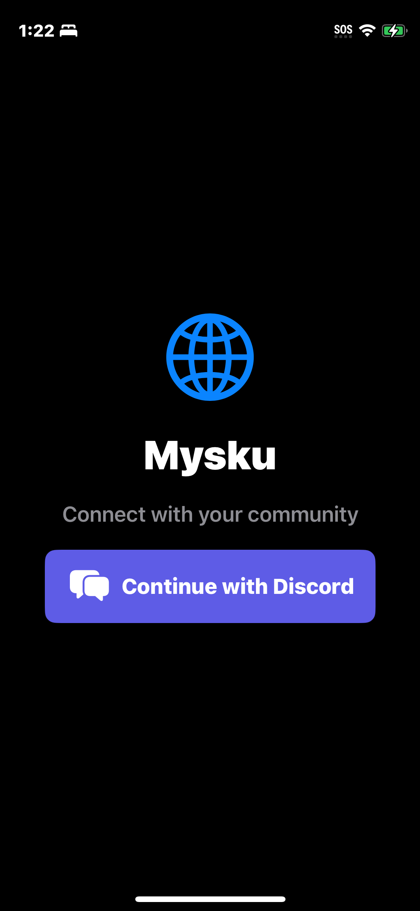
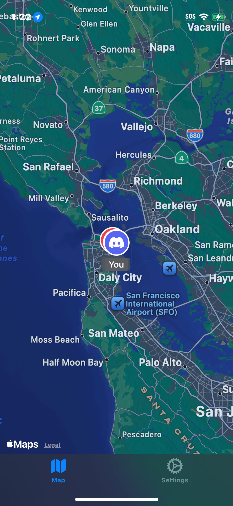
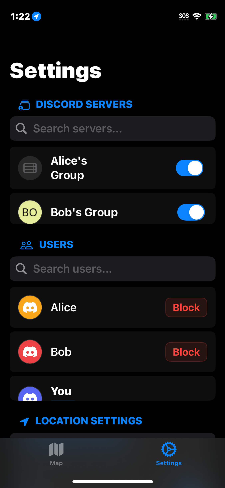
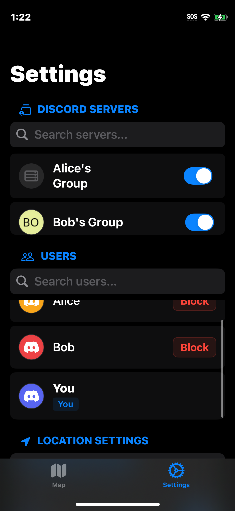
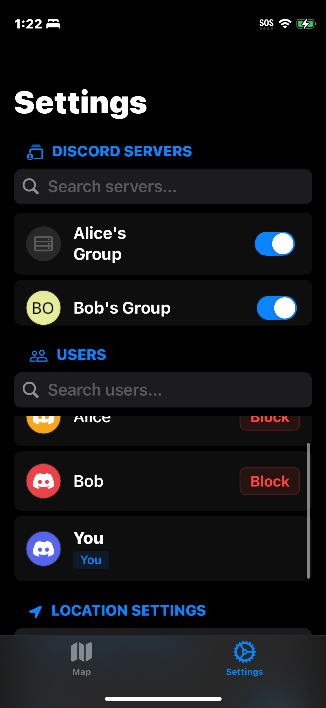

# UI Improvements for mysku

This PR adds screenshots of the current UI state and implements various UI improvements across the app.

## Screenshots
The PR includes screenshots that showcase the following app views:

### Launch and Authentication Flow
-  - Launch screen before login
-  - Login screen after logout
-  - Map view after successful login

### Settings Views
-  - Top section
-  - Middle section
-  - Bottom section
-  - Account section
-  - Notifications section
-  - Location settings (variation 1)
-  - Location settings (variation 2)
-  - Final settings view

## UI Changes Implemented

### Separable Changes
1. **Authentication Flow Improvements**
   - Redesigned login screen with cleaner interface
   - Improved user feedback during authentication process
   - Streamlined logout experience

2. **Settings Menu Reorganization**
   - Restructured settings into logical sections (Account, Notifications, Location)
   - Added visual hierarchy to make navigation more intuitive
   - Improved toggle switches and input fields for better usability

3. **Location Sharing UI Enhancements**
   - Redesigned map view with clearer location indicators
   - Added privacy controls directly in the map interface
   - Improved friend location visibility options

4. **General UI Refinements**
   - Enhanced color scheme for better visual consistency
   - Improved typography and spacing throughout the app
   - Fixed layout issues on different device sizes

Each of these changes can be implemented independently if needed. 